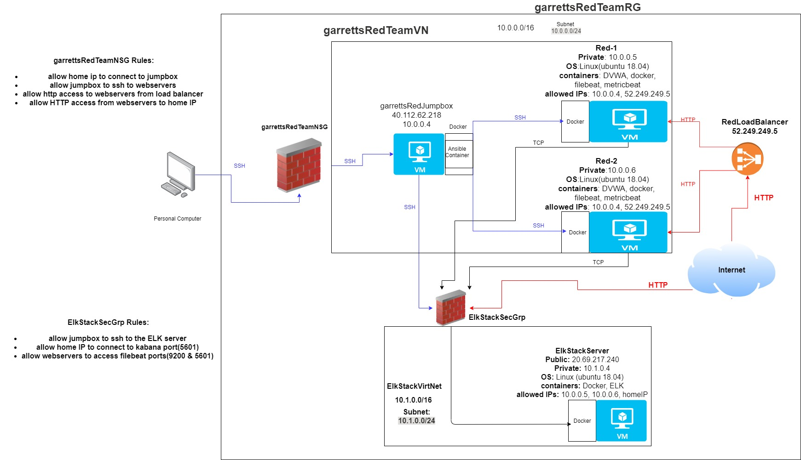

## Automated ELK Stack Deployment

The files in this repository were used to configure the network depicted below.

These files have been tested and used to generate a live ELK deployment on Azure. They can be used to either recreate the entire deployment pictured above. Alternatively, select portions of the filebeat-playbook.yml file may be used to install only certain pieces of it, such as Filebeat.

This document contains the following details:
- Description of the Topology
- Access Policies
- ELK Configuration
  - Beats in Use
  - Machines Being Monitored
- How to Use the Ansible Build

### Description of the Topology

The main purpose of this network is to expose a load-balanced and monitored instance of DVWA, the D*mn Vulnerable Web Application.

Load balancing ensures that the application will be highly scalable, in addition to restricting access to the network.

Integrating an ELK server allows users to easily monitor the vulnerable VMs for changes to the log files and system metrics.

The configuration details of each machine may be found below.

| Name     | Function | IP Address | Operating System |
|----------|----------|------------|------------------|
| Jump Box | Gateway  | 40.112.62.218 / 10.0.0.4   | Linux            |
| Red-1    |    Webserver      |   10.0.0.5         |    Linux              |
| Red-2     |     Webserver    |        10.0.0.6    |       Linux           |
| Elk Server     |  ELK stack server        |   20.69.217.240 / 10.1.0.4         |    Linux             |

### Access Policies

The machines on the internal network are not exposed to the public Internet. 

Only the JumpBox machine can accept connections from the Internet. Access to this machine is only allowed from the following IP addresses:
- 75.6.193.107

Machines within the network can only be accessed by the JumpBox.

A summary of the access policies in place can be found in the table below.

| Name     | Publicly Accessible | Allowed IP Addresses |
|----------|---------------------|----------------------|
| Jump Box | Yes             | 75.6.193.107    |
|  Red-1        |         no            |  10.0.0.4                    |
|        Red-2  |     no                |    10.0.0.4                   |
|        Elk Server  |     no                |     10.0.0.4                  |
|        Load Balancer  |     yes               |    75.6.193.107                |
### Elk Configuration

Ansible was used to automate configuration of the ELK machine. No configuration was performed manually, which is advantageous because it allows the playbooks created for this site to be used to automatically set up and new servers.

The playbook implements the following tasks:
- Install Docker
- Increase memory allotment
- download and launch Elk container
- enable docker on boot

The following screenshot displays the result of running `docker ps` after successfully configuring the ELK instance.

### Target Machines & Beats
This ELK server is configured to monitor the following machines:
- 10.0.0.5
- 10.0.0.6

We have installed the following Beats on these machines:
- Filebeat
- Metricbeat

These Beats allow us to collect the following information from each machine:
- Filebeat collects and monitors log files which can be used to view most significant events that happen on the server such as ssh connections.
- Metricbeat collects metric data from applications and services which helps to monitor things such as databases and webserver software.

### Using the Playbook
In order to use the playbook, you will need to have an Ansible control node already configured. Assuming you have such a control node provisioned: 

SSH into the control node and follow the steps below:
- Copy the filebeat config file to the target machines /etc/filebeat/filebeat.yml.
- Update the host file to include the webserver and elk server ips
- Run the playbook, and navigate to the elk server to check that the installation worked as expected.